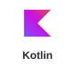
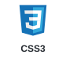
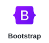
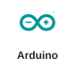

<!-- ===== HEADER BANNER ===== -->

<!-- ===== TYPING ANIMATION ===== -->

  

<!-- ===== SOCIAL BUTTONS ===== -->

  &nbsp;
  &nbsp;
  &nbsp;
  

  

 

<!-- ===== ABOUT ME ===== -->
### 🧑‍💻 About Me

<table>
  <tr>
    <td width="60%" valign="middle">
      
    </td>
    <td width="40%" valign="middle" align="center">
      
    </td>
  </tr>
</table>

---

<!-- ===== TECH STACK ===== -->
### 💻 Tech Stack

  &nbsp;
  &nbsp;
  &nbsp;
  &nbsp;
  &nbsp;
  &nbsp;
  &nbsp;
  &nbsp;
  &nbsp;
  &nbsp;
  &nbsp;
  &nbsp;
  &nbsp;
  &nbsp;
  &nbsp;
  &nbsp;
  &nbsp;
  &nbsp;
  &nbsp;
  &nbsp;
  &nbsp;
  &nbsp;
  &nbsp;
  &nbsp;

---

<!-- ===== GITHUB STATS ===== -->
### 📊 GitHub Analytics

  

---

<!-- ===== QUOTE ===== -->

  

<!-- ===== FOOTER ===== -->

